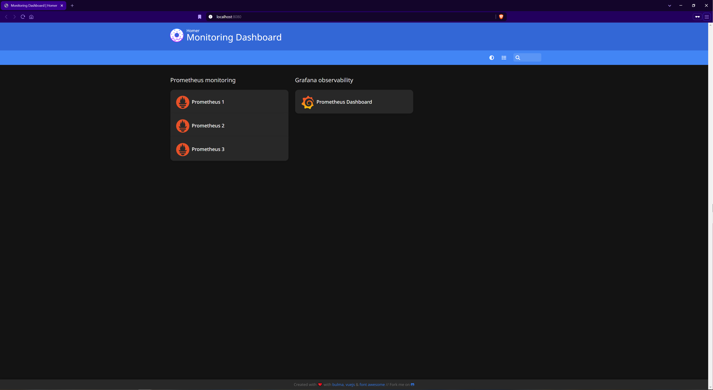
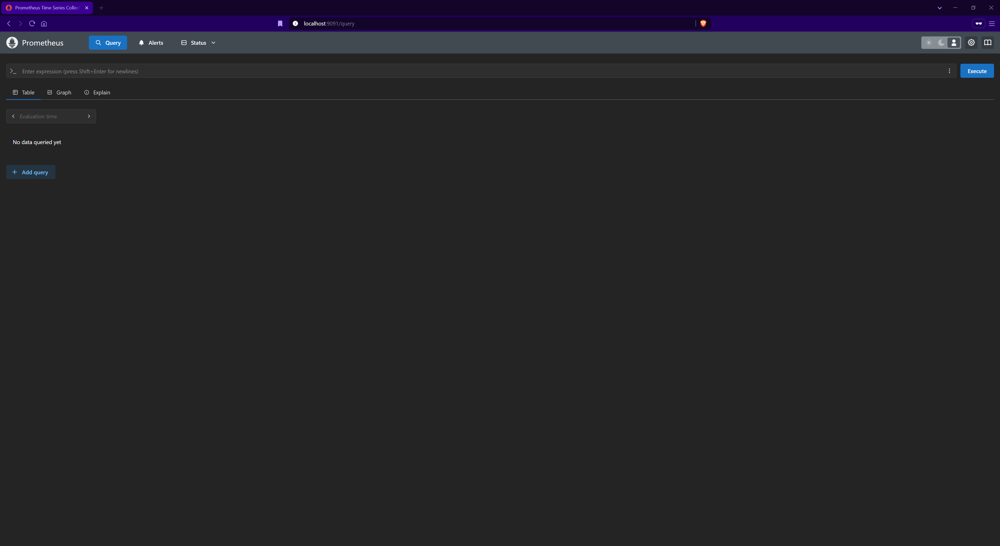
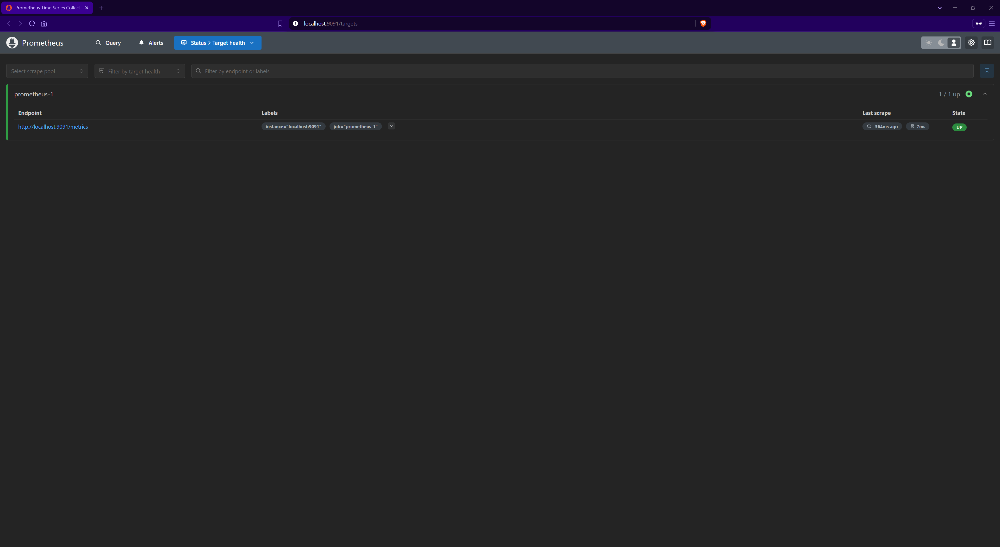
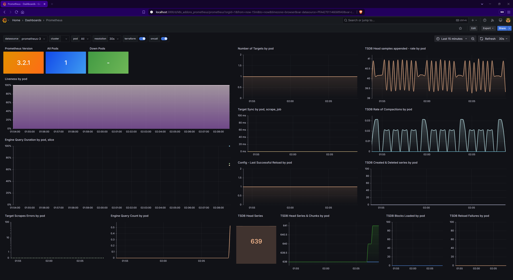

Monitoring stack (Prometheus + Grafana + Homer)

Tento projekt obsahuje kompletní Docker Compose konfiguraci monitorovacího stacku, který zahrnuje:
- tři instance Promethea, 
- Grafanu pro vizualizaci metrik a 
- Homer jako centrální dashboard.

**Obsah repozitáře:**
```
devops-task/
├── docker-compose.yml
├── README.md
├── assets/
│   ├── grafana-dashboard.png
│   ├── homer-dashboard.png
│   ├── prometheus-query.png
│   └── prometheus-targets.png
├── config/
│   ├── prometheus-dashboard.json
│   ├── prometheus-1.yml
│   ├── prometheus-2.yml
│   ├── prometheus-3.yml
│   └── grafana/
│       ├── dashboards/
│       │   └── prometheus-dashboard.json
│       └── provisioning/
│           └── dashboards/
│               └── dashboards.yml
└── homer/
    └── assets/
        └── custom/
            ├── grafana.png
            ├── homer.png
            └── prometheus.png
```

**Požadavky:**
- Docker
- Docker Compose

**Jak projekt spustit:**
1. Naklonujte repozitář:
```
git clone https://github.com/ILXNAH/devops-task.git
cd devops-task
```

2. Spusťte služby pomocí docker-compose:
```
docker-compose up -d
```

- První spuštění stáhne všechny potřebné image a nastaví služby.

3. Ověření, že vše běží správně:

**Prometheus monitoring:**
- Prometheus 1
- Prometheus 2
- Prometheus 3

Každá instance scrapuje sama sebe na portu 9091.

**Grafana observability**:
- Grafana běží na adrese: http://localhost:3000/
- Přihlášení: admin / admin
Grafana má připravené datasources pro všechny 3 Prometheus instance a jeden předdefinovaný dashboard monitorující interní metriky Promethea.

**Homer dashboard (homepage):**
- Homer je dostupný na adrese: http://localhost:8080/ 
- Dashboard obsahuje odkazy na všechny tři Prometheus instance a Grafanu s přehlednými ikonami.

Ukončení běhu kontejnerů:
- Pro vypnutí kontejnerů použijte:
```
docker-compose down
```

Všechna data Grafany jsou persistentní díky použití Docker volume (grafana-data).

Ukázky aplikací:
- Homer dashboard s odkazy:
  
- Prometheus Query UI:
  
- Prometheus Targets UI:
  
- Grafana Dashboard:
  

Poznámka: 
Všechny konfigurační soubory jsou připraveny a verzovány v repozitáři pro maximální transparentnost a snadnou správu. 
Služby jsou připravené k použití ihned po spuštění bez další ruční konfigurace.

